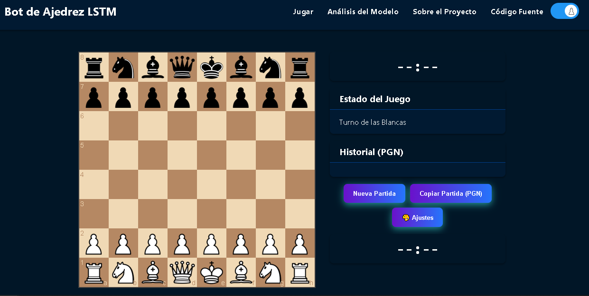
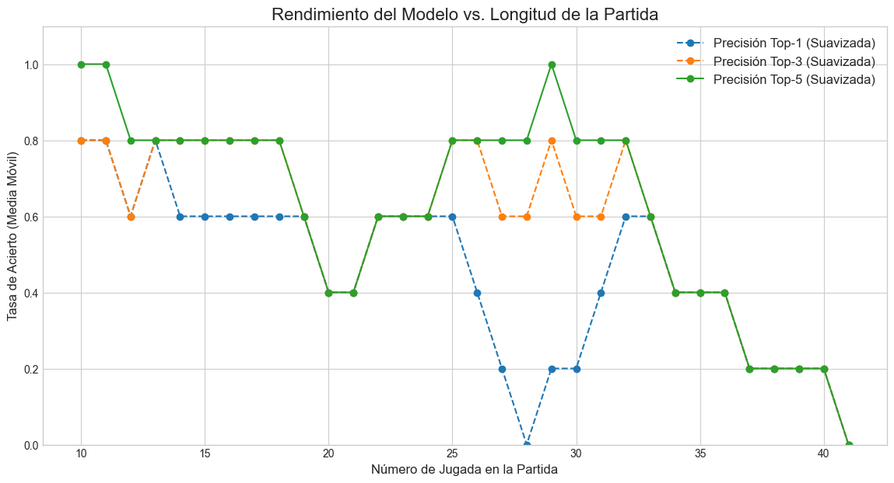
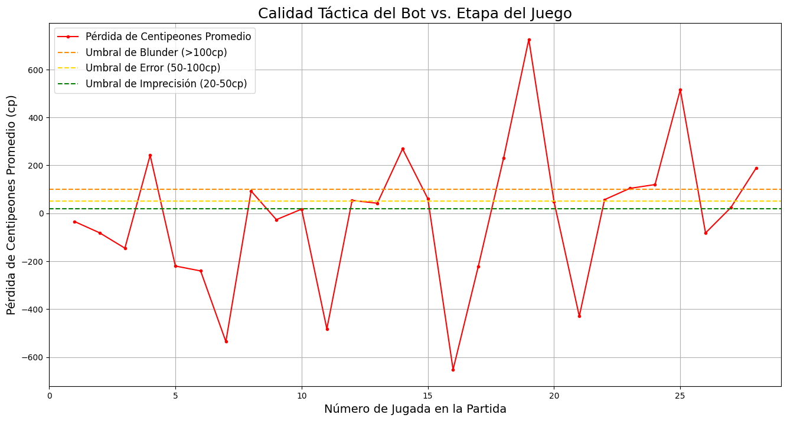

# Roque Chess V1 - Un Bot de Ajedrez con IA ♟️

**[➡️ JUGAR DEMO EN VIVO ⬅️](https://nahuelito22.github.io/Bot_Ajedrez/docs/)**

**Roque Chess** es un bot de ajedrez diseñado para jugar con un estilo "humano", aprendiendo de una base de datos de **1 millón de partidas** de jugadores de alto nivel (2000+ ELO) de la plataforma Lichess.

A diferencia de los motores tradicionales que se basan en el cálculo bruto, este proyecto utiliza una **Red Neuronal Recurrente (LSTM)** para predecir el siguiente movimiento más probable, imitando la intuición y el conocimiento posicional de jugadores experimentados.

 


---

## 🌟 Características

La aplicación web cuenta con una interfaz completa y personalizable:

* **Juego Interactivo:** Jugá directamente contra el bot en tu navegador.
* **Controles de Tiempo:** Configurá partidas con minutos e incremento por jugada.
* **Personalización Visual:**
    * **41 Estilos de Piezas:** Elegí entre una vasta colección de sets de piezas.
    * **Selector de Color de Tablero:** Múltiples temas de colores para el tablero.
    * **Modo Claro y Oscuro:** Adaptá la interfaz a tu preferencia.
    * **Punto de movimientos validos:** Personalizacion de colores.
* **Funcionalidades de Juego:**
    * Historial de la partida en formato PGN.
    * Botón para copiar el PGN al portapapeles.
    * Botón de "Nueva Partida".
    * Botón de personalizació visual.

---

## 🔬 Análisis del Modelo

Se realizó un análisis exhaustivo del rendimiento del modelo (`modelo_epoch_07.keras`) para determinar su fuerza y estilo de juego.

### Rendimiento General
El bot demuestra un conocimiento de nivel experto en las aperturas y una precisión casi perfecta en los finales, pero es tácticamente vulnerable en el medio juego.



### Calidad Táctica
El análisis de **Pérdida de Centipeones** revela una personalidad de "cañón de cristal": el bot tiene una profunda comprensión posicional (pérdida promedio negativa de -55cp), pero comete errores tácticos graves (picos altos) que son castigados por motores tradicionales.



* **Elo Táctico Estimado:** Basado en la calidad promedio de sus jugadas, se estima una fuerza posicional de **~1555 Elo**.

---

## 🛠️ Stack Tecnológico

* **Machine Learning:** Python, TensorFlow, Keras, Scikit-learn, Pandas,Numpy.
* **Backend:** FastAPI (API), Uvicorn (Servidor).
* **Frontend:** HTML, CSS, JavaScript.
* **Análisis y Medición de Elo:** Cute Chess, Stockfish, Ordo.
* **Librerías de Ajedrez:** `python-chess` (backend), `chessboard.js` y `chess.js` (frontend).
* **Despliegue:** Hugging Face Spaces (backend), GitHub Pages (frontend).

---

## 🚀 Instalación y Uso Local

1.  **Clonar el repositorio:**
    ```bash
    git clone [https://github.com/Nahuelito22/Bot_Ajedrez.git](https://github.com/Nahuelito22/Bot_Ajedrez.git)
    cd Bot_Ajedrez
    ```

2.  **Crear y activar un entorno virtual:**
    ```bash
    py -3.12.10 -m venv venv
    venv\Scripts\activate
    ```

3.  **Instalar las dependencias:**
    ```bash
    pip install -r requirements.txt
    ```

4.  **Ejecutar los servidores locales:**
    * **Terminal 1 (Backend):** `uvicorn main:app --reload`
    * **Terminal 2 (Frontend):** `cd docs` y luego `py -m http.server 8001`
    * Abrí tu navegador en `http://localhost:8001`.

---

## 🙏 Agradecimientos y Créditos

Este proyecto fue posible gracias a una increíble cantidad de herramientas y comunidades de código abierto:

* **Dataset:** [Lichess Open Database](https://database.lichess.org/) por proveer millones de partidas.
* **Frontend:** [chessboard.js](https://chessboardjs.com/) y [chess.js](https://github.com/jhlywa/chess.js) por las fantásticas librerías para la interfaz.
* **Medición de Elo:** [Cute Chess](https://cutechess.com/) como el gestor de torneos, [Stockfish](https://stockfishchess.org/) como el motor de referencia, y [Ordo](https://github.com/michiguel/Ordo) para el cálculo de ratings.
* **Desarrollo:** Agradecimientos a las comunidades detrás de Python, FastAPI, TensorFlow y todas las librerías que hacen posible la IA moderna.
* **Formación:** Este proyecto fue la entrega final para la carrera de **Data Science** en [Coderhouse](https://www.coderhouse.com/). En primera instancia fue una simple RNN, pero con el tiempo se busco terminarlo y poder hacer un deploy un poco mas serio y robusto.

---

## ✍️ Autor

**Matias Nahuel Ghilardi Salinas**
* **GitHub:** [@Nahuelito22](https://github.com/Nahuelito22)
